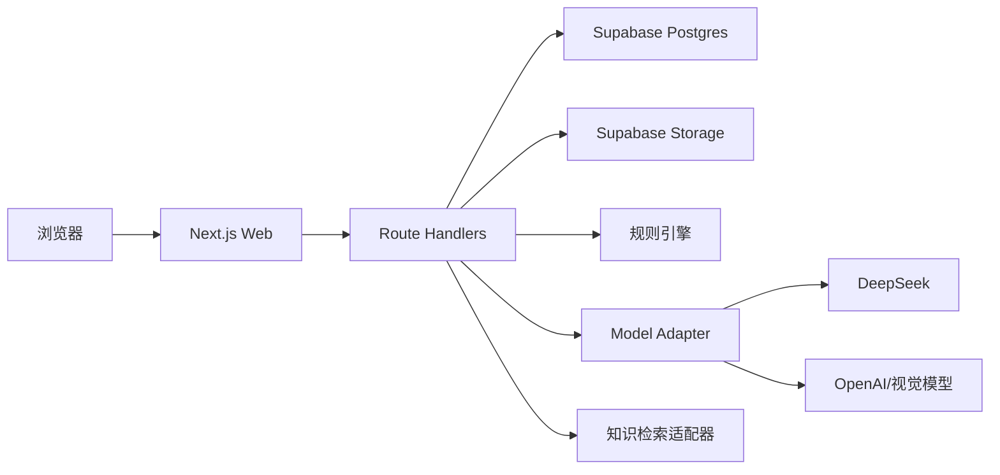

# FinPath MVP Spike 技术设计与开发手册 V1.0

> 文档状态：可执行草案  
> 目标读者：产品经理、Coding Agent、前端/全栈工程师  
> 核心目标：用最小技术成本验证 FinPath 是否能比通用大模型更稳定地完成真实金融任务  
> 原型基准：`design-references/P01-home.png` 至 `P11-task-detail.png`

---

## 1. Spike 要回答的问题

FinPath 不是“金融版聊天机器人”。Spike 必须证明下面五件事：

1. 用户提出模糊金融问题后，系统能识别场景并一次只追问一个关键条件。
2. 后端规则先产生约束，大模型只负责解释、组织和补充，不自由生成投资比例或收益承诺。
3. AI 结果能够稳定返回结构化数据，并被前端渲染成行动卡片。
4. 用户上传 PDF 或截图后，系统能提取关键字段、展示来源状态并允许用户确认。
5. 结果能保存为资金地图、方案和任务，使下次使用不必重新介绍情况。

如果上述五项不能稳定跑通，不继续开发社区、行情、量化、账户直连等功能。

## 2. 产品定位与边界

### 2.1 产品定位

FinPath 将模糊金融问题转换为“有条件、有证据、有风险说明、可执行、可持续跟踪”的行动路径。

三个核心用户任务：

- 帮我规划一笔钱。
- 帮我看懂一个金融产品。
- 帮我办成一件金融事情。

### 2.2 MVP 非目标

- 不提供实时证券行情。
- 不生成具体证券买卖指令。
- 不承诺收益或判断短期行情。
- 不连接银行卡、券商账户或网银。
- 不采集银行卡号、密码、验证码、身份证照片。
- 不建设独立社区信息流。
- 不使用多 Agent、LangGraph、Redis、Elasticsearch、Kubernetes。
- 不在第一阶段自建复杂向量检索服务。

## 3. MVP 范围

### 3.1 P0：必须真实跑通

#### 闭环 A：资金行动路径

`P01 → P02 → P03 → P10 → P08/P09`

- P01 提交自然语言金融问题。
- P02 根据缺失条件逐步澄清。
- P03 规则引擎生成约束，大模型生成解释和行动路径。
- 用户将路径保存为任务。
- P08 显示资金地图，P09 支持手工录入资产。

#### 闭环 B：产品说明书解读

`P04 → P05 → P10`

- 上传 PDF、PNG 或 JPG。
- 后端保存文件并调用文档解析适配器。
- 返回产品类型、风险、期限、是否保本、退出限制等字段。
- 用户确认或修正字段。
- 生成结构化产品解读与决定前检查清单。

### 3.2 P1：先使用静态数据

- P06 情境学习。
- P07 金融办事路线。
- P11 任务详情和相似经验。

这些页面先实现完整 UI、路由和 Mock 数据，不阻塞 Spike。

## 4. 技术架构决策

### 4.1 推荐架构



第一版采用单仓库一体化全栈。Next.js Route Handlers 就是后端 API，不是前端 Mock。只有当 PDF/OCR 处理明显需要 Python 生态时，才拆出 FastAPI 文档服务。

### 4.2 技术栈

| 层级 | 选择 | 用途 |
|---|---|---|
| 运行时 | Node.js 22、pnpm | 统一开发环境 |
| Web | Next.js App Router、TypeScript 严格模式 | 页面、服务端渲染、API |
| UI | Tailwind CSS、shadcn/ui、Radix UI | 还原原型与可访问组件 |
| 图表 | Recharts | 资产分布和进度 |
| 表单 | React Hook Form、Zod | 澄清、资产录入、文件确认 |
| 数据 | Supabase PostgreSQL | 用户、方案、资产、任务、资料 |
| 登录 | Supabase Auth | 邮箱登录与会话 |
| 文件 | Supabase Storage | 用户上传文件 |
| AI | Vercel AI SDK + Provider Adapter | 流式输出、模型切换 |
| 文本模型 | DeepSeek 默认，OpenAI 可切换 | 澄清、解释、结构化输出 |
| 文件解析 | Provider Adapter | 首版直传视觉模型，后续 Docling |
| 测试 | Vitest、Testing Library、Playwright | 单元、组件、端到端 |
| 部署 | Vercel + Supabase | MVP 快速发布 |

### 4.3 DeepSeek 使用策略

DeepSeek API 兼容 OpenAI/Anthropic 调用格式，支持 JSON Output、Tool Calls 和 Responses API，可通过配置适配到现有 Agent 或 SDK。官方资料：

- https://api-docs.deepseek.com/
- https://api-docs.deepseek.com/guides/json_mode/
- https://api-docs.deepseek.com/guides/tool_calls/
- https://api-docs.deepseek.com/guides/responses_api/

建议：

- Coding Agent 可以使用 DeepSeek，但必须具备读写仓库、终端执行和测试能力。
- 产品运行时的文本任务默认使用 DeepSeek。
- PDF/图片解析通过独立 `DocumentAnalyzer` 接口实现，不与文本模型绑定。
- 所有模型输出均经过 Zod 校验；失败后只重试一次，再转入可解释的失败状态。
- 禁止在业务组件中直接调用任何模型 SDK。

## 5. 可复用开源项目

| 项目 | 复用范围 | 注意事项 |
|---|---|---|
| https://github.com/vercel/chatbot | AI 流式交互、消息持久化、AI SDK 组织方式 | 参考架构和局部实现，不照搬 UI |
| https://github.com/supabase-community/chatgpt-your-files | 文件上传、RAG、RLS、pgvector | 第二阶段知识库参考 |
| https://github.com/fastapi/full-stack-fastapi-template | FastAPI 服务拆分、Docker、测试 | 只有拆 Python 服务时采用 |
| https://github.com/docling-project/docling | PDF、OCR、表格结构提取 | 第二阶段；MIT 许可证 |
| https://github.com/we-promise/sure | 财务账户与净资产数据模型 | AGPLv3，只研究逻辑，不复制到闭源代码 |
| https://github.com/langchain-ai/langgraph | 长任务和状态恢复 | MVP 不引入 |
| https://github.com/triggerdotdev/trigger.dev | 文档后台任务、重试和队列 | 单次解析超过部署超时后再引入 |

复用任何代码前必须在 `docs/third-party-reuse.md` 记录仓库 URL、Commit SHA、许可证、复用文件和修改说明。

## 6. 前端实现规范

### 6.1 路由

| 页面 | 路由 | MVP 状态 |
|---|---|---|
| P01 | `/` | 真实 |
| P02 | `/diagnosis/[sessionId]` | 真实 |
| P03 | `/plans/[planId]` | 真实 |
| P04 | `/documents/new` | 真实 |
| P05 | `/documents/[documentId]` | 真实 |
| P06 | `/learn/[slug]` | 静态数据 |
| P07 | `/routes/[routeId]` | 静态数据 |
| P08 | `/money-map` | 真实 |
| P09 | `/money-map?drawer=add-asset` | 真实抽屉 |
| P10 | `/tasks` | 真实 |
| P11 | `/tasks/[taskId]` | 任务真实、经验 Mock |

### 6.2 Design Token

```css
:root {
  --background: #F6F7F3;
  --surface: #FFFFFF;
  --text-primary: #18312D;
  --text-secondary: #6E7B77;
  --primary: #276B5D;
  --primary-hover: #1F5A4E;
  --primary-soft: #E7F2EE;
  --border: #DDE6E2;
  --warning: #D7953F;
  --warning-soft: #FFF4DE;
  --danger: #C65B5B;
  --radius-card: 18px;
  --radius-control: 12px;
  --shadow-card: 0 8px 28px rgba(24, 49, 45, 0.05);
}
```

- 中文字体：`PingFang SC, HarmonyOS Sans SC, Noto Sans SC, sans-serif`。
- 数字字体：`Inter, ui-sans-serif`。
- 主标题：36—40px，字重 650—700。
- 模块标题：20—24px。
- 正文：16—17px，不得低于 14px。
- 8px 间距体系；卡片内边距 24—32px。
- 桌面画布以 1440×960 原型为基准，主内容最大宽度约 1200px。

### 6.3 公共组件

```text
AppShell
Sidebar
PageHeader
AIQuestionInput
ClarificationCard
OptionCard
ConclusionCard
AllocationCard
SourceBadge
RiskNotice
ProgressBar
TaskCard
AssetSummaryCard
AssetFormDrawer
FileUploader
DocumentFieldRow
EmptyState
ErrorState
SkeletonState
```

组件内不得混入业务请求；所有数据通过 props 或 hooks 注入。

### 6.4 必须实现的状态

每个真实页面至少覆盖：

- 初始状态。
- Loading/Skeleton。
- 成功状态。
- 空数据状态。
- 可恢复失败状态。
- 权限或登录失效状态。
- 信息过期状态。
- AI 输出校验失败状态。

## 7. 后端模块

```text
src/server/
├── ai/
│   ├── provider.ts
│   ├── deepseek.ts
│   ├── openai.ts
│   ├── prompts/
│   └── schemas/
├── rules/
│   ├── liquidity.ts
│   ├── emergency-fund.ts
│   ├── debt-priority.ts
│   └── plan-builder.ts
├── documents/
│   ├── analyzer.ts
│   ├── storage.ts
│   └── extraction.ts
├── knowledge/
│   ├── repository.ts
│   └── retrieval.ts
├── tasks/
├── assets/
└── auth/
```

### 7.1 API 清单

| 方法 | 地址 | 功能 |
|---|---|---|
| POST | `/api/diagnosis` | 创建诊断会话 |
| GET | `/api/diagnosis/:id` | 获取当前问题和摘要 |
| POST | `/api/diagnosis/:id/answer` | 提交答案，返回下一问或完成状态 |
| POST | `/api/diagnosis/:id/generate-plan` | 运行规则并生成解释 |
| GET | `/api/plans/:id` | 获取行动路径 |
| POST | `/api/plans/:id/save-task` | 保存为任务 |
| GET/POST | `/api/assets` | 查询或新增资产 |
| PATCH/DELETE | `/api/assets/:id` | 更新或删除资产 |
| GET | `/api/money-map` | 聚合资金地图 |
| GET/POST | `/api/tasks` | 查询或新增任务 |
| PATCH | `/api/tasks/:id` | 更新任务状态 |
| PATCH | `/api/tasks/:id/steps/:stepId` | 完成任务步骤 |
| POST | `/api/documents` | 创建上传记录并返回上传地址 |
| POST | `/api/documents/:id/analyze` | 分析文件并返回字段 |
| PATCH | `/api/documents/:id/extraction` | 保存用户确认字段 |
| POST | `/api/documents/:id/generate-report` | 生成产品解读 |

所有写接口必须验证登录、输入 Schema 和资源所有权。

## 8. 数据模型

### 8.1 核心表

```text
profiles
  id, display_name, city, risk_preference, created_at, updated_at

diagnosis_sessions
  id, user_id, raw_question, scenario_type, status,
  current_question_key, answers_json, created_at, updated_at

plans
  id, user_id, diagnosis_session_id, conclusion,
  constraints_json, allocations_json, actions_json,
  risks_json, source_ids_json, model_metadata_json, created_at

assets
  id, user_id, type, amount_min, amount_max, currency,
  liquidity, expected_use_at, purpose, created_at, updated_at

goals
  id, user_id, title, target_amount, current_amount, target_date, status

tasks
  id, user_id, source_type, source_id, title, status,
  progress_current, progress_total, next_action, created_at, updated_at

task_steps
  id, task_id, position, title, status, source_ids_json, completed_at

documents
  id, user_id, storage_path, file_name, mime_type, size_bytes,
  status, deleted_at, created_at

document_extractions
  id, document_id, extracted_fields_json, confirmed_fields_json,
  provenance_json, model_metadata_json, created_at, updated_at

knowledge_sources
  id, title, publisher, source_url, region, effective_at,
  last_verified_at, status, content, tags_json
```

所有用户表启用 Supabase Row Level Security。禁止把银行卡号、密码、验证码和身份证号码写入任何表。

## 9. 规则引擎

### 9.1 原则

- 规则引擎负责硬约束和风险优先级。
- 大模型不得直接决定产品购买或收益判断。
- 规则输出必须可测试、可解释、可复现。
- 金额仅使用区间也可以运行。

### 9.2 最小输入

```ts
type DiagnosisInput = {
  amountRange: { min: number; max: number };
  expectedUseHorizon: "anytime" | "within_1y" | "1_to_3y" | "after_3y";
  emergencyFundMonths?: number;
  incomeStability?: "low" | "medium" | "high";
  highInterestDebt?: boolean;
  lossTolerance?: "none" | "small" | "medium";
};
```

### 9.3 最小输出

```ts
type RuleResult = {
  hardConstraints: string[];
  liquidityPriority: "high" | "medium" | "low";
  debtPriority: "first" | "parallel" | "none";
  buckets: Array<{
    key: "reserve" | "stable" | "learning";
    percentageRange: [number, number];
    rationaleCodes: string[];
  }>;
  missingCriticalFields: string[];
};
```

只有规则结果生成后，模型才能负责生成用户可读文案。

## 10. AI 结构化输出

### 10.1 场景识别

```ts
const ScenarioSchema = z.object({
  scenario: z.enum(["money_plan", "product_explain", "financial_route", "learning", "other"]),
  confidence: z.number().min(0).max(1),
  knownFacts: z.record(z.string(), z.unknown()),
  missingCriticalFields: z.array(z.string()),
  safetyFlags: z.array(z.string())
});
```

### 10.2 澄清问题

```ts
const ClarificationSchema = z.object({
  key: z.string(),
  question: z.string().max(60),
  reason: z.string().max(80),
  options: z.array(z.object({ value: z.string(), label: z.string() })).min(2).max(5),
  skippable: z.boolean()
});
```

### 10.3 行动路径

```ts
const ActionPlanSchema = z.object({
  conclusion: z.string().max(80),
  summary: z.string().max(160),
  buckets: z.array(z.object({
    key: z.enum(["reserve", "stable", "learning"]),
    label: z.string(),
    percentage: z.number().min(0).max(100),
    action: z.string().max(80)
  })).length(3),
  nextActions: z.array(z.object({ title: z.string(), timeframe: z.string() })).max(5),
  risks: z.array(z.string()).max(5),
  sourceIds: z.array(z.string()),
  disclaimer: z.string()
});
```

模型返回后必须再次校验：总比例为 100、没有具体证券代码、没有收益承诺、sourceId 均存在。

## 11. 文档解析

### 11.1 MVP 流程

1. 浏览器向 Supabase Storage 直传文件。
2. 后端校验 MIME、大小、资源归属。
3. `DocumentAnalyzer` 获取临时文件地址。
4. 视觉模型提取字段并返回原文依据。
5. Zod 校验后写入 `document_extractions`。
6. 用户确认字段，再生成产品解读。

### 11.2 提取字段

- 产品名称。
- 产品类型。
- 风险等级。
- 是否保本。
- 期限。
- 提前退出限制。
- 展示收益及其性质。
- 起购金额。
- 管理费、销售费、赎回费。
- 未识别或相互冲突的信息。
- 每个字段的页码、原文片段和置信度。

### 11.3 升级触发条件

满足任一条件时引入 Docling/FastAPI：

- PDF 解析经常超过 Serverless 超时。
- 扫描件和复杂表格失败率超过 15%。
- 单文件页数和大小明显增加。
- 需要本地处理敏感文件。

## 12. 知识库策略

### 12.1 Spike 阶段

知识条目先存 PostgreSQL，使用 `scenario_type + region + tags + status` 进行确定性筛选。资料规模较小时，不需要先上向量数据库。

每条来源必须包含：发布者、链接、地区、生效时间、最后核验时间和状态。

### 12.2 第二阶段

当知识条目超过约 200 条，或关键词召回明显不足时：

- 启用 Supabase pgvector。
- 使用独立 embedding provider。
- 文档切块保留来源、页码、标题和日期。
- 检索结果必须经过来源有效性过滤。

## 13. Prompt 设计原则

系统 Prompt 必须包含：

- 角色是金融行动教育助手，不是持牌投资顾问。
- 先补齐关键条件，再生成路径。
- 不根据短期行情推荐资产。
- 不承诺收益，不伪造来源。
- 无可靠来源时明确表示未知。
- 官方信息、平台规则和用户经验分开呈现。
- 只返回指定 JSON，不输出额外 Markdown。

Prompt 存入代码并版本化，例如：

```text
src/server/ai/prompts/
├── scenario-v1.ts
├── clarification-v1.ts
├── plan-explanation-v1.ts
└── document-analysis-v1.ts
```

每次调用记录 `provider/model/promptVersion/latency/tokenUsage/schemaValid`，不得记录敏感原文。

## 14. 安全、隐私与金融边界

- UI 和 API 同时限制文件类型和大小。
- Storage 使用私有 Bucket 和短时签名地址。
- Supabase RLS 隔离用户数据。
- 服务端环境变量不得以 `NEXT_PUBLIC_` 暴露。
- 日志中遮蔽金额、文件名和用户问题。
- 用户可以删除文件、会话、资产和任务。
- 每条 AI 结果标注“行动教育建议，不构成具体投资推荐”。
- 发现用户请求绕过监管、隐瞒身份或提供交易密码时拒绝并提示安全做法。

## 15. 测试与评测

### 15.1 自动化测试

- 规则引擎单元测试覆盖关键边界。
- Zod Schema 成功、失败和截断测试。
- API 鉴权、所有权和错误状态测试。
- P01→P03→P10→P08 Playwright 主链路。
- P04→P05 文件链路使用固定测试 PDF。
- 视觉回归至少覆盖 1440×960 和 1280×800。

### 15.2 与通用模型对照

准备 20—30 道真实问题，评价：

- 关键条件追问完整率。
- 结构化输出成功率。
- 来源有效率。
- 行动清单可执行率。
- 越权推荐和收益承诺率。
- 用户盲选胜率。

产品继续投入的建议门槛：FinPath 对通用模型的用户盲选胜率达到 65%。

## 16. Spike 验收标准

| 指标 | 通过标准 |
|---|---|
| 页面还原 | 核心布局、颜色、字号和层级与原型一致 |
| 响应式 | 1440、1280 桌面宽度无溢出 |
| AI 澄清 | 一次只问一题，结构化输出成功率 ≥ 95% |
| 规则稳定 | 相同输入产生相同硬约束和桶范围 |
| 计划生成 | 无具体买卖指令、无收益承诺 |
| 文件上传 | PDF/PNG/JPG 成功，非法文件被拒绝 |
| 字段提取 | 固定测试集关键字段正确率 ≥ 85% |
| 任务闭环 | 方案可保存、继续、完成，并更新进度 |
| 隐私 | 无卡号密码字段，RLS 测试通过 |
| 测试 | lint、typecheck、unit、e2e 全部通过 |

## 17. 开发阶段

1. 阶段 0：仓库审计、依赖决策、实施计划。
2. 阶段 1：Design Token、AppShell、公共组件。
3. 阶段 2：P01—P11 静态页面；优先 P01—P05、P08—P10。
4. 阶段 3：Supabase、认证、资产和任务 CRUD。
5. 阶段 4：P01—P03 AI + 规则闭环。
6. 阶段 5：P04—P05 文件解析闭环。
7. 阶段 6：测试、视觉对比、错误状态和交付。

每个阶段必须独立提交、运行验证、汇报变更和遗留问题。不得一次性完成全部阶段。

## 18. 环境变量

```bash
NEXT_PUBLIC_SUPABASE_URL=
NEXT_PUBLIC_SUPABASE_ANON_KEY=
SUPABASE_SERVICE_ROLE_KEY=

AI_TEXT_PROVIDER=deepseek
AI_DOCUMENT_PROVIDER=openai

DEEPSEEK_API_KEY=
DEEPSEEK_BASE_URL=https://api.deepseek.com
DEEPSEEK_MODEL=

OPENAI_API_KEY=
OPENAI_MODEL_TEXT=
OPENAI_MODEL_DOCUMENT=

MAX_UPLOAD_MB=20
APP_ENV=development
```

密钥只写入本地 `.env.local` 或部署平台，不提交 Git。

## 19. 完成定义

Spike 完成不是“11 张页面都能打开”，而是：

- 两条核心闭环可在真实数据库和真实模型上运行。
- 所有 AI 输出都通过 Schema 与业务规则校验。
- 用户可以理解结论、看到依据并完成下一步。
- 原型图视觉被稳定还原。
- Coding Agent 能通过测试证明，而不是只口头宣称完成。

## 20. Coding Agent 执行提示词

下面的提示词可以直接作为 DeepSeek 或 Codex 的首次任务：

```text
你是一名资深 AI 产品全栈工程师、前端设计工程师和测试工程师。请在当前仓库中开发 FinPath MVP。

开始前必须完整阅读：
1. 本技术手册。
2. FinPath_UI页面映射与验收清单_V1.0.md。
3. design-references/P01-home.png 至 P11-task-detail.png。

FinPath 的目标是把模糊金融问题变成有条件、有来源、有风险说明、可执行和可持续跟踪的行动路径。它不是普通聊天机器人、荐股工具或自动交易工具。

强制规则：
- 先审计仓库、依赖、Git 状态和运行环境，不要立即重写项目。
- 保留用户已有改动，不使用破坏性 Git 命令，不删除无关文件。
- 使用 Next.js App Router、TypeScript strict、Tailwind、shadcn/ui、Supabase 和 Provider Adapter。
- 业务组件不得直接调用模型 SDK。
- 规则引擎先产生硬约束，大模型只负责解释和组织。
- 所有 AI 输出必须通过 Zod Schema 校验。
- 禁止收益承诺、具体证券买卖指令、短期行情推荐和伪造来源。
- API Key 只从环境变量读取，禁止提交到 Git。
- 按阶段开发；每阶段运行 lint、typecheck、test、build，并汇报后暂停。
- 不自行增加实时行情、银行连接、社区信息流、多 Agent、LangGraph、Redis 或自建复杂 RAG。

当前只执行阶段 0，不改业务代码。请输出：
1. 仓库结构和现有技术栈。
2. 可复用的已有代码。
3. 与技术手册冲突之处。
4. 推荐目录结构和新增依赖。
5. 分阶段实施计划。
6. 缺失的环境变量和外部资源。
7. 风险、阻塞项和需要用户决定的问题。

完成阶段 0 后停止，等待确认。
```

完整的阶段 1—6 提示词位于：

`FinPath_DeepSeek_Codex开发执行提示词_V1.0.md`

将本手册、提示词、UI 映射文档和 `design-references/` 一起提供给 DeepSeek 或 Codex。Agent 必须先阅读全部材料并执行阶段 0，得到确认后再写业务代码。
